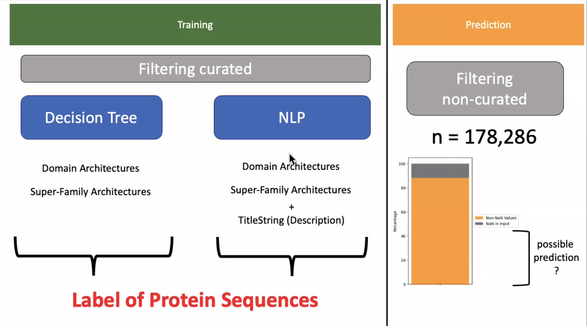

# SPARCLE Curation
## Team Gwadz-Yang

In order to assist a small team of experts manually annotating subfamily protein architectures in the SPARCLE database, we trained a decision tree and an NLP model on the roughly 42k expert-curated architectures in order to automate assignment of labels to the remaining roughly 200k uncurated protein architectures. 

## Table of Contents

1. [Introduction](#introduction)
2. [Methods](#methods)
3. [Results](#results)
4. [Discussion & Conclusion](#discussion--conclusion)
5. [References](#references)
6. [Acknowledgement](#acknowledgements)
7. [Team Members](#team-members)

## INTRODUCTION

SPARCLE, the Subfamily Protein Architecture Labeling Engine, is a resource for the functional characterization and labeling of protein sequences that have been grouped by their characteristic conserved domain architecture. 

A domain architecture is defined as the sequential order of conserved domains in a protein sequence.  see: https://www.ncbi.nlm.nih.gov/Structure/sparcle/docs/sparcle_about.html

Primarily, names and functional annotations are added through manual curation. However, it would be preferable if automated processes could support and supplement curation efforts. Currently, there are over 42k curated architechtures out of over 200k in the SPARCLE database.  Autamated processes to name could be based on using previously curated architectures to name related architectures. (because the CDD imports domain models from multiple resources, there can be numerous CDs that model overlapping protein footprints (clusters of these models are called 'superfmailies'). Therefore, numerous architectures could be given the same name ) Another approach could be to use name and labels attached to CDs and superfamilies within an arhictecture to predict a useful name for the architecture. 

### Scope and Research Questions

* RQ1: Given a set of curated domain architecture names (`CurName`), can we predict a good name for related architectures based on the specific domain architectures (`SpecificArch`) and the superfamily architecures (`superfamilyarch`).

* RQ2: Will addition of architecture title strings (`TitleString`) to the input matrix improve prediction accuracy of curated names (`CurName`)?

## METHODS

* RQ1 Methods

Inputs: 
A matrix of one-hot encoded curated names (`CurName`) and associated specific (`SpecificArch`) and superfamily (`superfamilyarch`) architectures derived from the SPARCLE table of 42,766 curarted protein architectures.

Output: 
Curated names (`CurName`) for uncurated architectures given their specific conserved domains (`SpecificArch`) and superfaimly architectures (`superfamilyarch`).

Example: 
Architecture 1 (`ArchID` 1) has specific CDs (`SpecificArch`): `cd12718 cd16457 pfam02148`, and this superfamily string (`superfamilyArch`, the cluster that each of those CDs belongs to): `zf-UBP RRM_SF RING_Ubox` and a curated name: `BRCA1-associated protein`.

Can we predict a name for a related architecture with archstring: `cd12718 cd16457 pfam02148 cl34174` and superfamily string: `zf-UBP RRM_SF RING_Ubox Smc`? Expert curators have given this the same name.

* RQ2 Methods

Inputs: 
A matrix of one-hot encoded curated names (`CurName`) and associated specific (`SpecificArch`) and superfamily (`superfamilyarch`) architectures derived from the SPARCLE table of 42,766 curarted protein architectures with the addition of Word2Vec embedded architecture title strings (`TitleString`).

Output: 
Curated names (`CurName`) for uncurated architectures given their specific conserved domains (`SpecificArch`), superfaimly architectures (`superfamilyarch`), and architecture title strings (`TitleString`).

Example: 
Architecture 1 (`ArchID` 1) has specific CDs (`SpecificArch`): `cd12718 cd16457 pfam02148`, superfamily string (`superfamilyArch`): `zf-UBP RRM_SF RING_Ubox`, curated name: `BRCA1-associated protein`, and title string (`TitleString`): `brca1-associated protein`.

Can we predict a name for a related architecture with archstring: `cd12718 cd16457 pfam02148 cl34174` and superfamily string: `zf-UBP RRM_SF RING_Ubox Smc`?

Categorization Model to auto-name SPARCLE architectures (ordered arrangement of protein domains).

1. organize data in one-hot encoded matrix. 
	rows- curated architecture examples.  target value is curated names (28,055 categories, prior to simplification)
	features/columns all possible specific-hits (domain) or superfamilies (domain clusters)= 41,888 
2. simplify categories to eliminate overly specific names and to increase # examples/category 
3. choose >=1  ML models to evaluate data (e.g. Decisions trees, Deep Learning, Clustering?) 
4. choose strategy for training /test given sparse data
5. possible to add tokenized "title names" as features?
6. evaluate most promising model- tweak, if possible. 
7. option - test trained model vs uncurated data to estimate impact. 

## Results

## Future Work

## NCBI Codeathon Disclaimer
This software was created as part of an NCBI codeathon, a hackathon-style event focused on rapid innovation. While we encourage you to explore and adapt this code, please be aware that NCBI does not provide ongoing support for it.

For general questions about NCBI software and tools, please visit: [NCBI Contact Page](https://www.ncbi.nlm.nih.gov/home/about/contact/)

## ACKNOWLEDGEMENTS

## TEAM MEMBERS

* Marc Gwadz, Affiliation (Team Leader)
* Mingzhang Yang, Affiliation (Technical Lead)
* Christopher Meyer, University of Chicago (Writer)
* Franziska Ahrend, Affiliation
* Yixiang Deng, Affiliation
* Shaojun Xie, Affiliation
